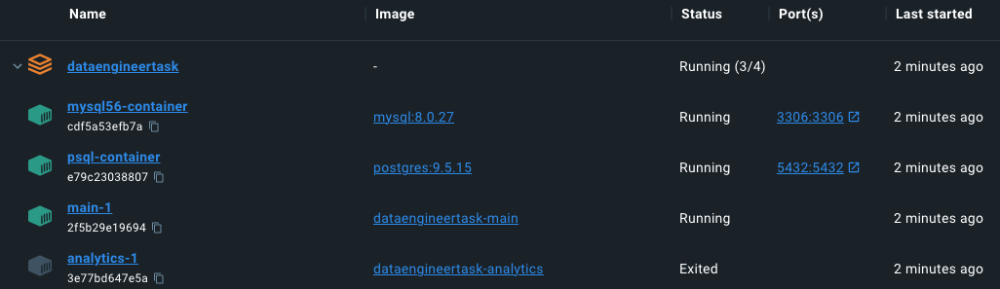

# Simple ETL Exercise using Docker Compose

## 🗄 This uses two main services:
1. `main` - simulates devices that send data to a Postgres table (`devices`) every second (3 records / second):
   
| Column      | Data Type | Notes                                                 |
| ----------- | --------- | ----------------------------------------------------- |
| device_id   | UUID      | The unique ID of the device sending the data.         |
| temperature | Integer   | The temperature measured by the device.               |
| location    | JSON      | Latitude and Longitude of the position of the device. |
| time        | Timestamp | The time of the signal as a Unix timestamp.           |

2. `analytics` - Runs an ETL process to extract the device data, apply transformations, and load data into a MySQL table (`analytics`).

| Column          | Data Type | Notes                                                                                  |
| --------------- | --------- | -------------------------------------------------------------------------------------- |
| device_id       | UUID      | The unique ID of the device sending the data.                                          |
| hour            | DateTime  | Date and hour from which the aggregations are calculated.<br>Ex: `2023-04-16 17:00:00` |
| max_temperature | Integer   | Max temperature recorded _per device per hour_                                         |
| total_distance  | Float     | End-to-end distance traveled _per device per hour_                                     |
| data_points     | Integer   | Number of data points recorded _per device per hour_                                   |


## ▶️ Running the scripts
Run ``` docker compose up``` in root directory

**Docker compose will run 4 services. `analytics-1` will exit after running the ETL process once.**


**Sample logs from `analytics` service**
```
2023-04-16 13:40:00.232 | SUCCESS  | db:get_db_engine:35 - Connection is active.
2023-04-16 13:40:00.256 | INFO     | utils:wait_for_data:11 - Waiting for device data...
2023-04-16 13:40:00.259 | INFO     | utils:wait_for_data:16 - db_count=27
2023-04-16 13:40:03.267 | INFO     | utils:wait_for_data:16 - db_count=36
2023-04-16 13:40:06.274 | INFO     | utils:wait_for_data:16 - db_count=45
2023-04-16 13:40:09.280 | INFO     | utils:wait_for_data:16 - db_count=54
2023-04-16 13:40:09.281 | INFO     | __main__:<module>:15 - ETL starting...
2023-04-16 13:40:09.288 | SUCCESS  | etl:extract_device_data:26 - Device data received: (54, 4)
2023-04-16 13:40:09.305 | DEBUG    | etl:get_device_analytics:53 -                               device_id  ... total_distance
0  210ae4e1-aa88-48e9-b962-aa070a0b725a  ...   17341.773522
1  a6fdbd91-d4a3-402a-84b1-7a5a4c7c23bb  ...   12218.057924
2  e8d2ccbd-33dd-4925-93e5-5ae6e75a3686  ...   18743.831264
[3 rows x 5 columns]
2023-04-16 13:40:09.330 | SUCCESS  | etl:insert_analytics_data:62 - Inserted 3 records
```

**Analytics for the 3 devices will be stored in MySQL**

