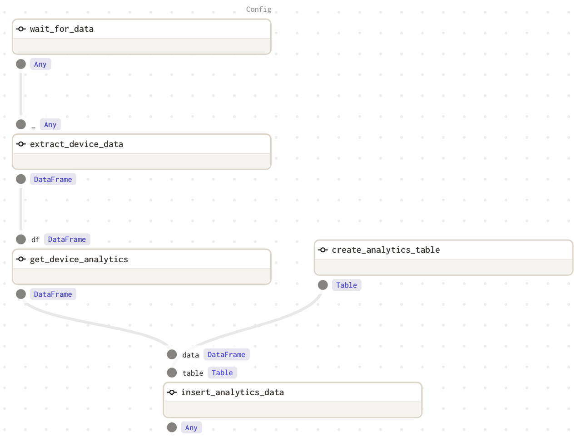
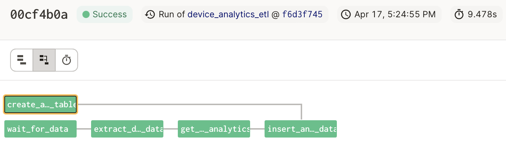
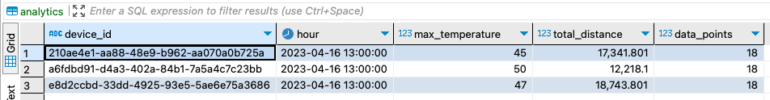

# Simple ETL Exercise using Docker Compose

## 🗄 This uses two main services:
1. `main` - simulates devices that send data to a Postgres table (`devices`) every second (3 records / second):
   
| Column      | Data Type | Notes                                                 |
| ----------- | --------- | ----------------------------------------------------- |
| device_id   | UUID      | The unique ID of the device sending the data.         |
| temperature | Integer   | The temperature measured by the device.               |
| location    | JSON      | Latitude and Longitude of the position of the device. |
| time        | Timestamp | The time of the signal as a Unix timestamp.           |

2. `analytics` - Runs an ETL process to extract the device data, apply transformations, and load data into a MySQL table (`analytics`).

| Column          | Data Type | Notes                                                                                  |
| --------------- | --------- | -------------------------------------------------------------------------------------- |
| device_id       | UUID      | The unique ID of the device sending the data.                                          |
| hour            | DateTime  | Date and hour from which the aggregations are calculated. Ex: `2023-04-16 17:00:00` |
| max_temperature | Integer   | Max temperature recorded _per device per hour_                                         |
| total_distance  | Float     | End-to-end distance traveled _per device per hour_                                     |
| data_points     | Integer   | Number of data points recorded _per device per hour_                                   |

## ▶️ Running the ETL process using Dagster
Run `docker compose up` in root directory.
This will do the following:
1. Spin up a Postgres DB and create a `devices` table
2. Spin up a MySQL DB
3. Run the Python script that inserts device data into the `devices` table.
4. Run `dagit` on port `3000`, which you can access on http://localhost:3000. You will be able to manually trigger the ETL job from here. 

**Alternatively, docker compose can automatically run the ETL job without using Dagit UI.**\
Simply change the command for `analytics` service in `docker-compose.yml` to:\
`[ "dagster", "job", "execute", "-f", "analytics.py" ]`

**Analytics for the 3 devices will be stored in MySQL**

## Assumptions
1. The ETL job will only be run once, since this is only a simple exercise. It can be extended to run on schedule and calculate device analytics every hour. This will require a small change in the query to only pull the data that has not been processed.
2. "Total distance" means the end-to-end distance traveled by the device (straight line path). An alternative interpretation is the cumulative distance traveled (from point A to B to C and so on...)